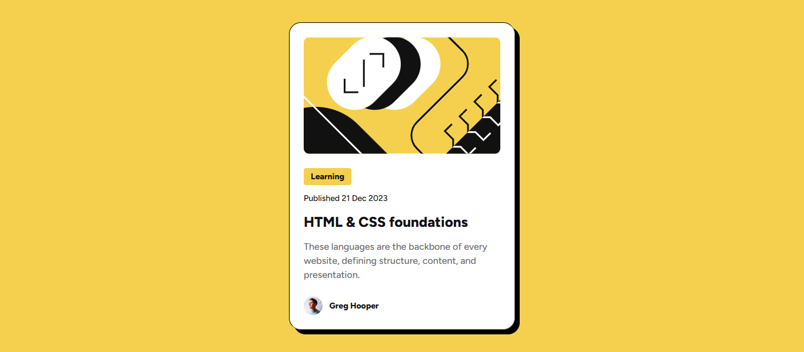

# Frontend Mentor - Blog preview card solution

This is a solution to the [Blog preview card challenge on Frontend Mentor](https://www.frontendmentor.io/challenges/blog-preview-card-ckPaj01IcS). Frontend Mentor challenges help you improve your coding skills by building realistic projects.

## Table of contents

- [Overview](#overview)
  - [The challenge](#the-challenge)
  - [Screenshot](#screenshot)
  - [Links](#links)
- [My process](#my-process)
  - [Built with](#built-with)
  - [What I learned](#what-i-learned)
  - [Continued development](#continued-development)
  - [Useful resources](#useful-resources)
- [Author](#author)

## Overview

### The challenge

Users should be able to:

- See hover and focus states for all interactive elements on the page

### Screenshot

### Links

- Solution URL: [Solution URL](https://github.com/ahsanma/blog-preview-card-main)
- Live Site URL: [Live Site URL](https://ahsanma.github.io/blog-preview-card-main/)

## My process

### Built with

- Semantic HTML5 markup
- CSS custom properties
- Flexbox

### What I learned

- Introduction to Variable Fonts
- Little more indepth flexbox compared to QR Code Challenge
- Responsive Typography using `clamp()`

### Continued development

- More indepth Flexbox
- Responsive Design using Media Queries
- CSS Grid

### Useful resources

- [Font Size Clamp Generator](https://clamp.font-size.app/) - This helped me calculate the responsive font sizes.

## Author

- Website - [ahsanma](https://github.com/ahsanma/)
- Frontend Mentor - [@ahsanma](https://www.frontendmentor.io/profile/ahsanma)
